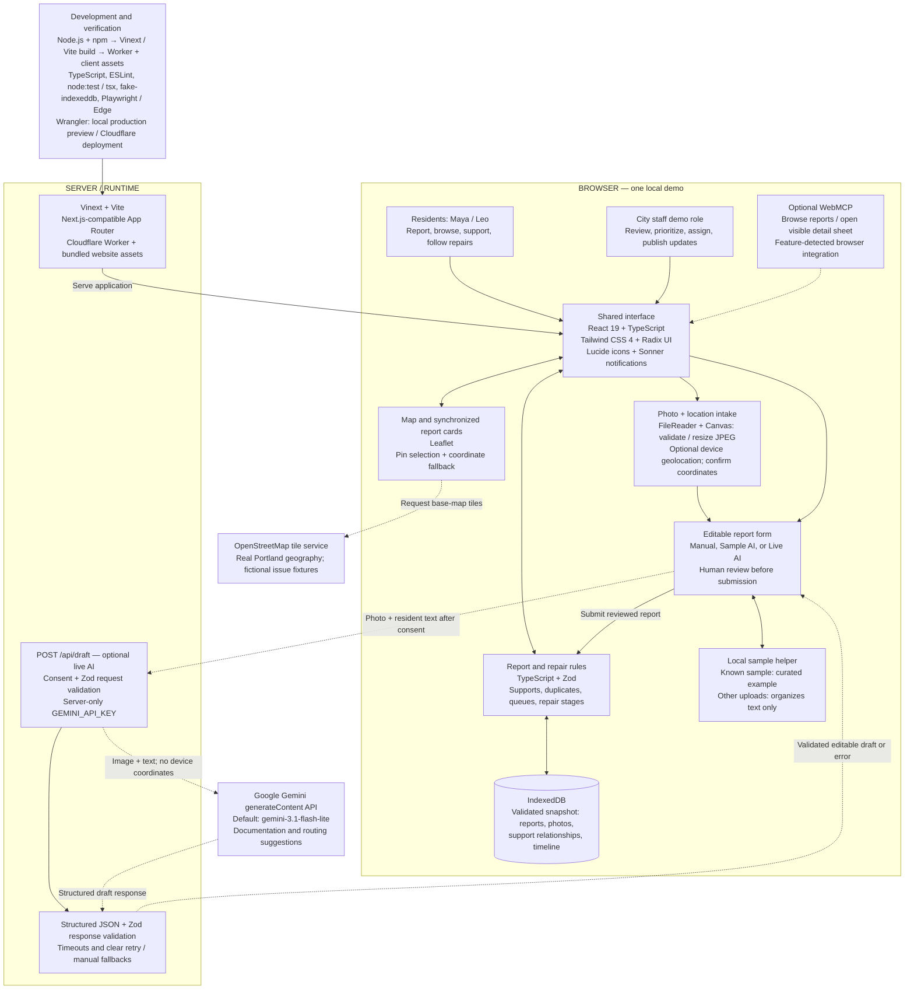
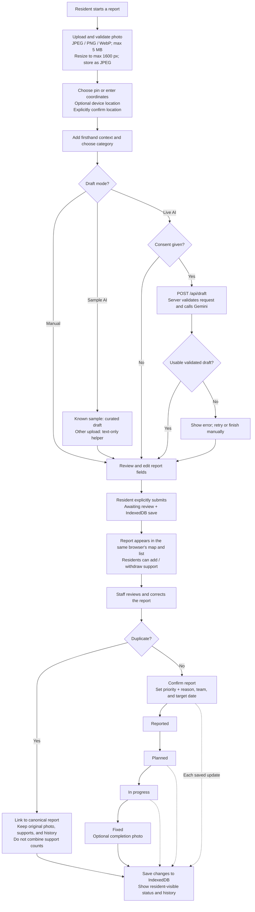

# StreetFix architecture

Open **[architecture.svg](architecture.svg)** in a browser for the presentation flowchart, or use **[architecture.png](architecture.png)** in slides. The SVG is a standalone vector image: zoom without losing quality, insert it into slides, or print it to PDF. Technology logos are embedded, so the diagram works offline. The diagrams below provide editable Mermaid versions and a closer look at the reporting workflow.

The chart uses recognizable technology logos beside the relevant components and a labeled technology stack strip. Logo sources are recorded in [logos/README.md](logos/README.md).

## A 45-second walkthrough

“StreetFix connects resident reporting and city staff repair updates in one interface. React and TypeScript power the screens, while Leaflet displays reports on an OpenStreetMap base map. Residents upload a photo, explicitly confirm its location, and review the description before submitting. Zod validates the data, and IndexedDB stores the report, photo, supports, and repair history in that browser.

“AI is optional. The sample helper runs locally; live assistance sends the photo and resident text through a server endpoint to Google Gemini after consent. The server keeps the API key private and validates the response. The draft is editable, and staff still decide urgency and assignment. Vinext and Vite build the application into website assets and a Cloudflare Worker. This prototype demonstrates the connected workflow in one browser; a shared city pilot would need a shared backend and real authentication.”

## Architecture flowchart

Solid arrows show application and data flow. Dashed arrows show optional or external connections. Both roles use the same local data; the role selector supplies demo identities.

## Report-to-repair flow

## Frameworks and their jobs

| Technology                                             | What it does here                                                                                                                                                      |
| ------------------------------------------------------ | ---------------------------------------------------------------------------------------------------------------------------------------------------------------------- |
| **TypeScript**                                   | Typed report data, UI, domain rules, and server route.                                                                                                                 |
| **React 19**                                     | Shared resident/staff interface, forms, state, and synchronized views.                                                                                                 |
| **Vinext + Vite 8**                              | Runs the Next.js-compatible App Router application and builds client assets and the Worker. The active runtime is Vinext;`next` is also installed for compatibility. |
| **Tailwind CSS 4 + custom CSS**                  | Theme, styling utilities, and responsive app layout.                                                                                                                   |
| **Radix UI / shadcn-style components**           | Dialogs, detail sheets, tabs, selectors, and other UI primitives.                                                                                                      |
| **Lucide React + Sonner**                        | Icons and user notifications.                                                                                                                                          |
| **Leaflet + OpenStreetMap**                      | Interactive map/markers and externally fetched map tiles.                                                                                                              |
| **Zod**                                          | Validates local snapshots, report data, AI requests, and returned drafts.                                                                                              |
| **IndexedDB**                                    | Browser database for reports, normalized photos, supports, and timelines.                                                                                              |
| **Browser FileReader, Canvas, Geolocation APIs** | Read and normalize uploaded photos; optionally request device location.                                                                                                |
| **Google Gemini API**                            | Optional photo-and-text documentation assistance via server-side HTTP requests. Default model:`gemini-3.1-flash-lite`.                                               |
| **Cloudflare Workers + Wrangler**                | Built server runtime, local production preview, and deployment tooling. Local AI configuration uses ignored`.dev.vars`; production uses a Worker secret.             |
| **Node.js 22.13+ + npm**                         | Development commands, package installation, and build tooling.                                                                                                         |
| **TypeScript compiler + ESLint**                 | Static type and code checks.                                                                                                                                           |
| **node:test + tsx + fake-indexeddb**             | Model/persistence and mocked Gemini tests.                                                                                                                             |
| **Playwright + Microsoft Edge**                  | Browser acceptance checks of the real interface.                                                                                                                       |
| **WebMCP (optional)**                            | Browser feature detection exposes tools to read reports or open their visible detail sheet.                                                                            |

## Scope and supporting infrastructure

**Current data boundary.** Each browser/origin has its own IndexedDB snapshot. The map and list share React state; resident and staff roles act on that same snapshot. There is no shared municipal database or live synchronization across devices or tabs. When persistence fails, the app retains a usable session and offers retry. Reset replaces the entire snapshot with fictional seed data.

**AI boundary.** Manual and sample reporting require no AI provider. Sample mode does not analyze arbitrary uploaded photos. Live mode transmits the photo and supplied text only after consent; the model request omits device coordinates. The browser receives draft fields, not the secret key. Drafts do not submit reports, set authoritative urgency, or assign crews.

**Map boundary.** Seed reports are fictional fixtures over real Portland geography. Licensed representative photos are bundled in `public/photos`; credits are in `public/IMAGE-PROVENANCE.md`. If tiles fail, Leaflet still supports markers and pin selection over a labeled coordinate grid. If map initialization fails, the app retains list/manual workflows.

**Starter integrations present in the repository.** The Sites starter includes Cloudflare D1 / Drizzle ORM database scaffolding, R2 binding support, ChatGPT authentication helpers, and a request-scoped connector bridge with local preview infrastructure. D1 and R2 are `null` in `.openai/hosting.json`; StreetFix's report workflow does not use those services, authentication helpers, or external connectors. The demo role selector is not authentication. These are extension points, separate from the active report-storage and AI paths shown above.

**A future shared pilot** would add an authenticated report API, shared database and photo storage, real resident/staff permissions, audit/recovery controls, and AI request limits. Those components are future work, not implemented architecture.

## Where to find it in the code

| Component                                             | Source                                                  |
| ----------------------------------------------------- | ------------------------------------------------------- |
| App entry and layout                                  | `app/page.tsx`, `app/layout.tsx`                    |
| UI, local state, forms, role selector, WebMCP         | `components/streetfix-app.tsx`                        |
| Map, markers, tile fallback                           | `components/street-map.tsx`                           |
| Validated model, fixtures, support and staff rules    | `lib/streetfix.ts`                                    |
| IndexedDB and photo normalization                     | `lib/storage.ts`                                      |
| Optional AI HTTP route                                | `app/api/draft/route.ts`                              |
| Gemini request, response validation, failure handling | `lib/gemini-draft.ts`                                 |
| Styling and reusable UI                               | `app/globals.css`, `components/ui/`                 |
| Worker wrapper and build configuration                | `build/sites-worker.ts`, `vite.config.ts`           |
| Local launch/build and hosting bindings               | `scripts/run-framework.mjs`, `.openai/hosting.json` |
| Automated checks                                      | `tests/`, `playwright.config.ts`, `package.json`  |

This documents the implemented code, not a claim that a production city service has been deployed. For recorded verification results, see [VERIFICATION.md](../VERIFICATION.md); for hosting instructions, see [HOSTING.md](../HOSTING.md).
